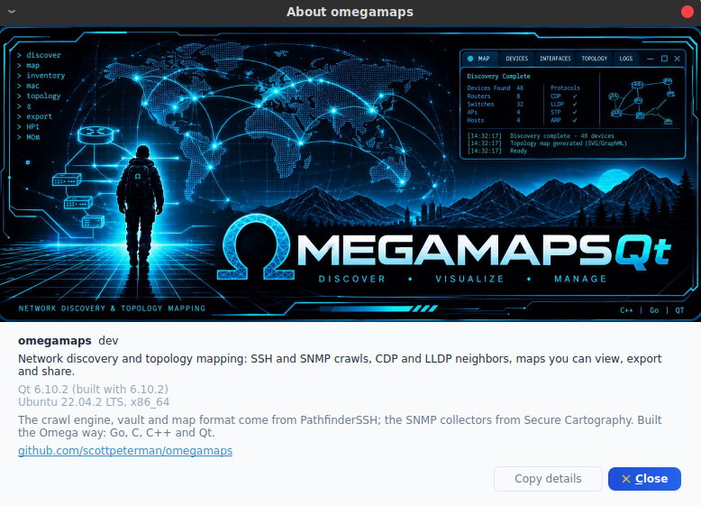

# omegamaps

Network topology discovery. Point it at a seed device and it crawls the
network over SNMP, SSH, or both -- collecting every device's LLDP and CDP
neighbors, one depth at a time -- and writes a map of devices, platforms,
addresses and the interfaces that connect them.

It comes as a desktop application, where you set up a crawl and watch it
happen, and as command-line tools for the same crawl without a window. Both
drive the same Go engine and write the same output: the Secure Cartography /
Pathfinder `map.json` format, unchanged, so tools that already read those maps
read these.


On a production multi-vendor network, a crawl that took about thirty minutes in
Secure Cartography (Python) finishes here in under five, with the same map
detail: platform, management address and every interface pair on every link.

## The application

Secure Cartography's three-column layout, over omegamaps' crawler:

- **Connection** -- seeds, domain suffixes, the domains devices may be dialed
  under, and exclude patterns.
- **Credentials** -- the vault's credentials, SSH and SNMP side by side: create
  or unlock the vault, add and remove credentials, and limit a crawl to
  credentials with given tags. The vault unlocks at startup from the OS
  keyring when its password has been saved there.
- **Discovery options** -- depth, concurrency, timeouts, the order to try SNMP
  and SSH, host-key policy and a known-hosts file, legacy SSH algorithms.
- **Output** -- a directory and a map name. Every crawl writes three files side
  by side: the map, a recording of the crawl, and a text log.
- **Run** -- Start, Test single (the first seed alone), Stop, and a status line
  that says what the run is doing and how it ended.


While it runs:

- **Progress** shows each depth as its own bar -- reached, failed, not dialed,
  in flight -- with counts, the credential attempts the crawl has cost, and the
  devices the current depth is still waiting on, longest first. A breadth-first
  crawl cannot know an overall percentage; it does know each depth.
- **Topology preview** draws the map as it grows: a device appears when it is
  claimed, in the row for its depth, under the device that reported it, with
  its state on its outline. When the crawl finishes, the reporting tree gives
  way to the real links. Search, fit and zoom work throughout.
- **Discovery log** records what the crawl did and decided: each device
  reached, and how and how long it took; fallbacks from SNMP to SSH; names
  retried at their reported address; rejected credentials; failures with their
  reasons. Devices deliberately not dialed are counted and grouped by reason,
  and listed on request.

Any recording can be opened and played back through the same views, in real
time or faster -- including a crawl that has just finished. Three themes:
Cyber, Dark and Light.

```bash
./scripts/build-app.sh            # finds Qt, configures, builds
./build/app/omegamaps             # the application
./build/app/omegamaps lab.events.jsonl --speed 10   # open a recording
```

## Command-line tools

| | |
|---|---|
| `crawl` | the crawler: seeds, methods, credentials and identity rules in; `map.json` out |
| `omvault` | the credential vault: `init`, `add`, `list`, `rm`, `enable`/`disable`, `default`, `keyring` |
| `mapview` | opens a `map.json` in the browser viewer; `omegamaps-viewer` is the same viewer as a window (below) |

```bash
./scripts/build.sh                                   # scripts\build.bat on Windows
./build/bin/omvault init                             # ~/.omegamaps/vault.json
./build/bin/omvault add -name lab-ro -auth snmp-v2c -tag lab   # prompts for the community
./build/bin/omvault add -name lab -user cisco -tag lab         # prompts for the password
./build/bin/omvault keyring set                      # optional: unlock from the OS keyring

./build/bin/crawl -vault ~/.omegamaps/vault.json -methods snmp,ssh \
    -seed 172.16.1.2 -domain lab.local -depth 5 \
    -events lab.events.jsonl -o lab.json -v
./build/bin/mapview -map lab.json
```

Every tool takes `-h` and `-version`. The crawl flags most runs use:

| | |
|---|---|
| `-seed` | where to start (repeatable, or comma-separated) |
| `-depth` | how many hops from the seeds (0 = seeds only; default 3) |
| `-methods` | `ssh`, `snmp`, or both in the order to try them (default `ssh`) |
| `-vault` | the credential vault; credentials are resolved per device |
| `-cred-tag` | use only credentials carrying these tags |
| `-concurrency` | devices collected at once within a depth (default 5) |
| `-domain` | suffix completed onto bare neighbor names and stripped from the map |
| `-allow-domain` | dial only neighbors under these suffixes; everything else is mapped as a leaf |
| `-exclude` | substrings that make a neighbor a leaf: platform, hostname, sysName, or port description |
| `-known-hosts` | where first-contact SSH host keys are recorded (default `~/.ssh/known_hosts`) |
| `-legacy` | allow older SSH key exchanges and ciphers, for older IOS and NX-OS |
| `-jump` | reach devices through a bastion (`[user@]host[:port]`) |
| `-snmp-timeout` | per SNMP request (default 5s) |
| `-events` | record the crawl's event stream -- what the application shows and replays |
| `-v` | log every decision |

Without `-vault`, `-user`/`-key`/`-password` give one SSH credential for the
whole crawl, and SNMP credentials come from `OMEGAMAPS_SNMP_COMMUNITY` and
`OMEGAMAPS_SNMP_V3_*` -- never from flags, which would put them in `ps` and in
shell history.

## How a crawl works

The crawl is breadth-first from the seeds, one depth at a time, with up to
`concurrency` devices collected at once. A depth's neighbors are claimed only
after every device in it has finished, so a device reached from two directions
in the same depth is collected once.

**Collecting a device.** The methods are tried in the order given. SNMP reads
the system group, LLDP-MIB and CISCO-CDP-MIB, using collectors ported from
Secure Cartography 2.5 and validated against Junos, IOS and EOS; it is
vendor-neutral, and on most networks it is the fast path. SSH logs in,
identifies the platform, runs its neighbor commands and parses them with
TextFSM templates, for Cisco IOS, IOS-XE and NX-OS, Arista EOS, Juniper Junos,
Aruba ProCurve and AOS-CX, HP Comware, and Extreme EXOS. A device moves to the
next method when one fails, and also when one reaches it but finds no
neighbors -- a monitoring community whose view stops at the system group
answers SNMP with empty LLDP tables, and would otherwise map as a leaf.

**Credentials.** The vault holds SSH and SNMP credentials side by side --
password, key, agent, SNMP v2c and v3 -- and a resolver picks per device: the
credential that worked on that device last time first, then credentials scoped
to its domain, address range or platform, then by priority. A credential
rejected by enough distinct devices is parked for the rest of the run, and
attempts per device can be capped, which matters against a live AAA server.
The two kinds never stand in for each other: a community string is never tried
as an SSH password. A v2c community that gets no answer is not counted against
itself, because a wrong community and a host that is down look alike.

**Identity.** Neighbors are named the way they advertise themselves, completed
and stripped with the domain suffixes. A name that does not resolve is retried
at the address the neighbor reported, so a lab with no DNS crawls as well as a
network with it. A device reached by address takes its own sysName or prompt
as its name. Neighbors advertised by MAC address or as `localhost` are dialed at
their reported address, never at the crawling host. Exclude patterns and
allowed domains turn neighbors into leaves that are mapped but never dialed --
which keeps a crawl seeded on an edge router out of its peers' routers.

**Links.** A link between two devices that answered is kept only when both ends
report it with matching interfaces; trusting one-sided links is an option.
A device that was dialed and failed stays on the map as a leaf of whoever
reported it -- it could not report its own links, and the device you could not
log into is the one the map most needs to show.

**Host keys.** SSH host keys are trusted on first contact and recorded -- the
application can also require them to be known in advance -- and a key that has
changed is refused either way.

## Output

| | |
|---|---|
| `name.json` | the map: every device with its platform and management address, and its peers with each connecting interface pair. The Secure Cartography / Pathfinder format. |
| `name.events.jsonl` | the recording: depth batches, each device's phases, credential outcomes, fallbacks, decisions and results, as JSON Lines. What the application replays. |
| `name.log` | the crawl's text log, for when a device did something the recording does not explain |

The application always writes all three. `crawl` writes the map, and the
recording with `-events`.

The recording answers questions directly:

```bash
# how devices were collected, and why SNMP fell back
jq -r 'select(.kind=="reached") | .method' lab.events.jsonl | sort | uniq -c
jq -r 'select(.kind=="fallback") | .detail' lab.events.jsonl | sort | uniq -c | sort -rn
```

## Viewing and exporting maps

The map viewer: hierarchical, force-directed, breadth-first, concentric,
circle and grid layouts; undiscovered and leaf devices hidden or shown; a
hand-arranged layout saved and restored; device details on click; and export
to PNG, JSON, or draw.io -- with device icons or plain shapes, exported as
arranged on screen.

It comes two ways, one page behind both:

- **`omegamaps-viewer`**, a window of its own, which the application opens:
  **View map** in the run panel for the run just finished, **Open map...** in
  the header for any map. It takes the application's theme, and exports
  through native save dialogs. `omegamaps-viewer --theme dark lab.json` runs
  it directly. Needs Qt WebEngine; see [docs/BUILDING.md](docs/BUILDING.md).
- **`mapview`**, the same viewer in a browser, for a machine with only the
  command-line tools.


Saved layouts are kept per map in `~/.omegamaps/layouts`, so a layout saved in
either one comes back in both. The application's topology preview covers the
map during and just after a crawl.

## Where it runs

| | Command-line tools | Application |
|---|---|---|
| Linux | built and used | built and used |
| macOS | built | built and used |
| Windows | built (cross-compiled) | built |

The tools are pure Go: `./scripts/build.sh --cross` builds macOS, Linux and
Windows binaries from any one of them. The application needs Qt 6.2 or newer
with Widgets and Svg; the map viewer needs Qt WebEngine as well.
`scripts/build-app.sh` finds Qt on its own and says what is missing for the
viewer. On Windows the build also needs MSVC and a mingw-w64 gcc -- cgo has no
MSVC backend, so the Go archive is compiled by one and linked by the other --
and `scripts\bundle-windows.bat --zip` packages the result as a
self-contained folder. Details are in [docs/BUILDING.md](docs/BUILDING.md).

## Configuration

Everything lives in `~/.omegamaps/`: `vault.json`, and beside it the SSH and
SNMP credential bindings the resolver learns from, so the next crawl of the
same network starts with the credential each device took last time. The
master password comes from a prompt, `OMEGAMAPS_VAULT_PASSWORD`, or the OS
keyring (`omvault keyring set`, or the checkbox in the application's unlock
dialog). The application remembers its form between runs.

The vault file format is shared with Omega and Pathfinder, so either one's
vault can be opened deliberately. Nothing opens one by default.

## Building and testing

```bash
./scripts/build.sh          # tools: vet, race tests, build
./scripts/build-app.sh      # application
./test.sh -F                # also against the oldest supported dependency set
```

Two probes check the application with no display: `replay_probe` plays a
recording through the real window and checks what every view shows against
the run, and `crawl_probe` runs a live crawl of a simulated copy of the home
lab -- through the vault, the form and the window -- and checks the result.
Details, cross-compiling and the dependency floor are in
[docs/BUILDING.md](docs/BUILDING.md).

Parts of this project are built and tested in a Claude sandbox, which cannot
reach the Go module proxy; [docs/README_Claude_sandbox.md](docs/README_Claude_sandbox.md)
is the verified recipe for that environment and what it can and cannot prove.

## Layout

| | |
|---|---|
| `cmd/crawl`, `cmd/omvault`, `cmd/mapview` | the command-line tools |
| `app` | the application |
| `viewer` | the map viewer window, `omegamaps-viewer` |
| `capi`, `include/omegamaps` | the C surface the application sits on -- crawls, replays, the vault and the map viewer's server -- built as a Go c-archive |
| `internal/crawler` | the breadth-first crawl, method fallback, identity and claiming |
| `internal/crawldial` | assembles a crawl from parameters; shared by every front end |
| `internal/crawlrun` | parameters, events, the run model, the recording |
| `internal/snmpprobe` | SNMP collection: system group, LLDP-MIB, CISCO-CDP-MIB |
| `internal/sshcore`, `internal/netexec` | SSH sessions, platform identification, command execution |
| `internal/tfsm` | TextFSM templates for each platform's neighbor commands |
| `internal/credres`, `internal/dial` | per-device credential resolution, bindings, dialing |
| `internal/vault`, `internal/vaultcli` | the encrypted credential store and its unlock paths |
| `internal/normalize` | names, interfaces, platforms, and the rules for what is not a name |
| `internal/topo` | link validation and `map.json` |
| `internal/mapweb` | the map viewer's page and its loopback server, for `mapview` and `omegamaps-viewer` |
| `internal/fakedev` | a simulated SSH device for tests, and a simulated copy of the home lab |
| `tests` | the application probes, and `fakelab`, which runs the simulated lab |

## Where it came from

The crawl engine, credential resolver, vault, TextFSM templates and map format
come from PathfinderSSH, the author's earlier Go tool. The SNMP collectors are
a port of Secure Cartography 2.5's, and the application follows Secure
Cartography's layout. The Go → C → C++ → Qt construction, the build and the
sandbox approach follow [Omega](https://github.com/scottpeterman/omegasshqt).



## Next

**Map merging** -- combining crawls of different sites or seeds into one map
-- and packaging the viewer with the application on macOS and Windows.
Viewing and exporting are in (`omegamaps-viewer`).

After that:

- Editing credentials in place, and the keyring and master-password controls,
  in the credentials panel.
- A "what changed since the last crawl" view, from two recordings.
- Application bundles for Linux and macOS. Windows packages as a
  self-contained folder today (`scripts\bundle-windows.bat --zip`).

## Licence

Copyright (C) 2026 Scott Peterman.

omegamaps is free software: you may redistribute it and modify it under the
terms of the GNU General Public License version 3, as published by the Free
Software Foundation. It is distributed in the hope that it will be useful, but
WITHOUT ANY WARRANTY -- without even the implied warranty of MERCHANTABILITY or
FITNESS FOR A PARTICULAR PURPOSE. See [LICENSE](LICENSE) for the full text, and
[licenses/THIRD_PARTY_NOTICES.md](licenses/THIRD_PARTY_NOTICES.md) for the
components it incorporates.
